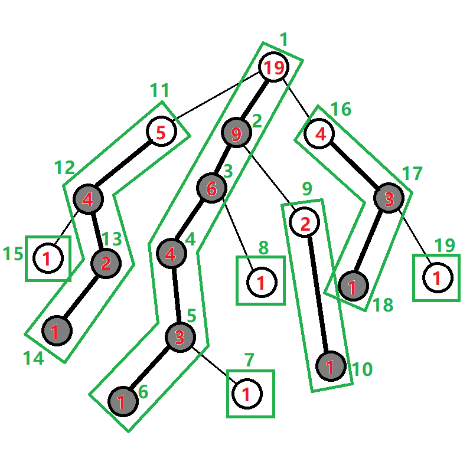

题目中提到让我们维护树上颜色段的数目，在把极长的连续相同颜色认为是一段后，我们可以通过树链剖分把它转化为序列上的问题，主要注意点就在于序列上以及树上相同颜色端的合并

---

### 一、线段树：

线段树维护自身这一段上的颜色段数，以及 lc 和 rc，分别记录右端点和左端点的颜色（方便合并时判断）

要注意在合并两个子区间的时候，如果左区间的右端点颜色 = 右区间的左端点颜色，那么这就是一段颜色段，则颜色段数量 - 1

pushup 以及查询合并左右答案时：

$$
p.num = ls.num + rs.num - (ls.rc == rs.lc);
$$

下传懒标记时把颜色数据更新为 `{1, p->lazy, p->lazy}` 即可

---

### 二、路径求和

主要看树链剖分后颜色的查询与更新，（修改几乎没变）：

我们发现树剖求 LCA 是利用两个点按照深度向上跳最后跳到一起的方法为



**自下而上，根据深度交替向上跳**

而这个转化后的序列我们就可以找到一些对我们有利的性质：
**在剖分出的链中，越靠近根节点（也就是 dep 越小），他的 dfn 值也是越小的**

对于一段序列， 我们不妨把对应到树上后把这个路径分成两边（它只涉及两个端点：左边和右边，这样，我们在一条一条链跳的过程中，把线段树中的左端点记录下来，在和下一次的颜色比较，如果当前往上跳的路径这次的起点颜色 == 当前要往上跳的路径上上次的终点颜色，那么颜色段数量 -1，就行了

`pos1` 表示在当前路径上上次的终点颜色

`pos2` 表示另一条路径上上一次的终点颜色

```cpp
tot += res.num - (res.rc == pos1);
pos1 = res.lc, u = fa[top[u]]; // 跳过轻边
```

如果当前要往上跳的节点所在路径发生了改变（也就是路径发生了交替），则 swap(pos1,pos2)

最后跳到一条链上时， 起点颜色就是线段树上查询的左端点的颜色，终点颜色就是查询的右端点的颜色，两边分别判断即可。

```cpp
auto res = segtr.query(dfn[u], dfn[v]);tot += res.num - (ans1 == res.lc) - (ans2 == res.rc);
```
